# IPL Dashboard

## Overview

IPL Dashboard is a web application built with Next.js that scrapes live IPL data from [iplt20.com](https://www.iplt20.com) and presents it in a user-friendly format. It features an interactive points table, match schedule, team details, venues, and visualizations using charts.

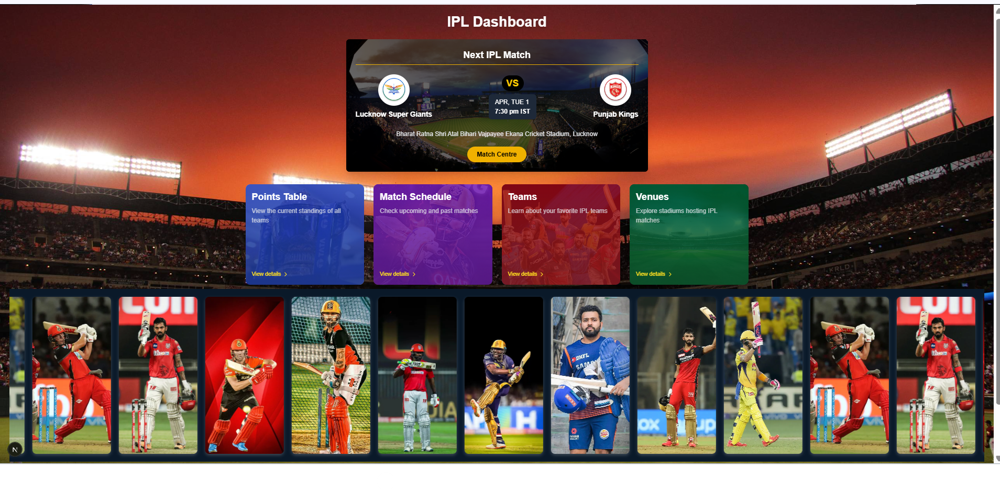
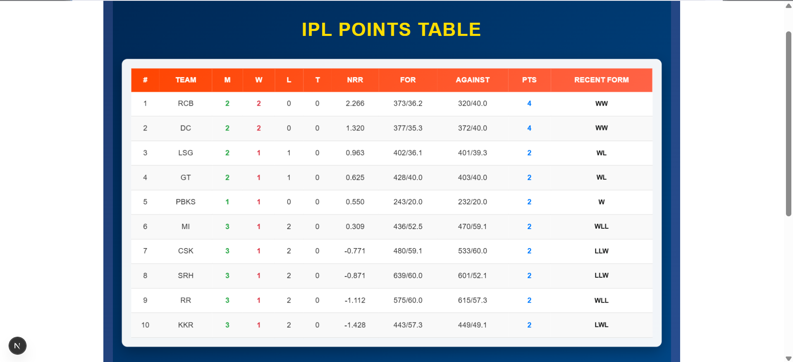
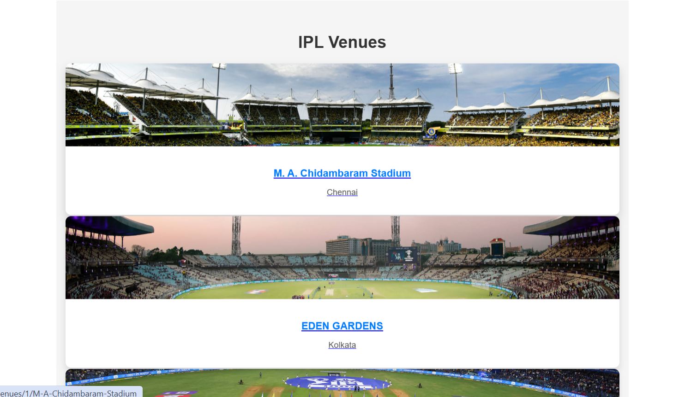
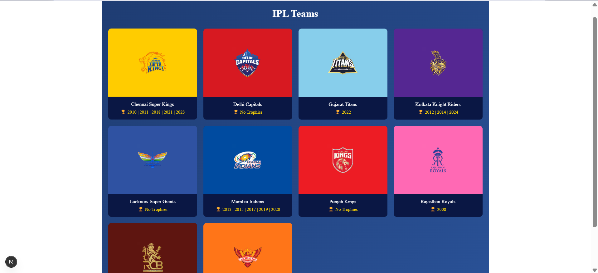
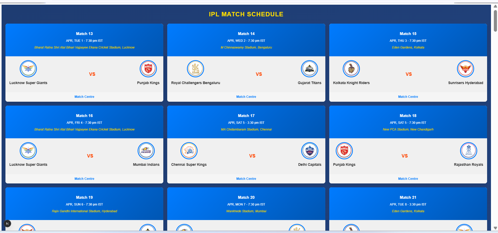
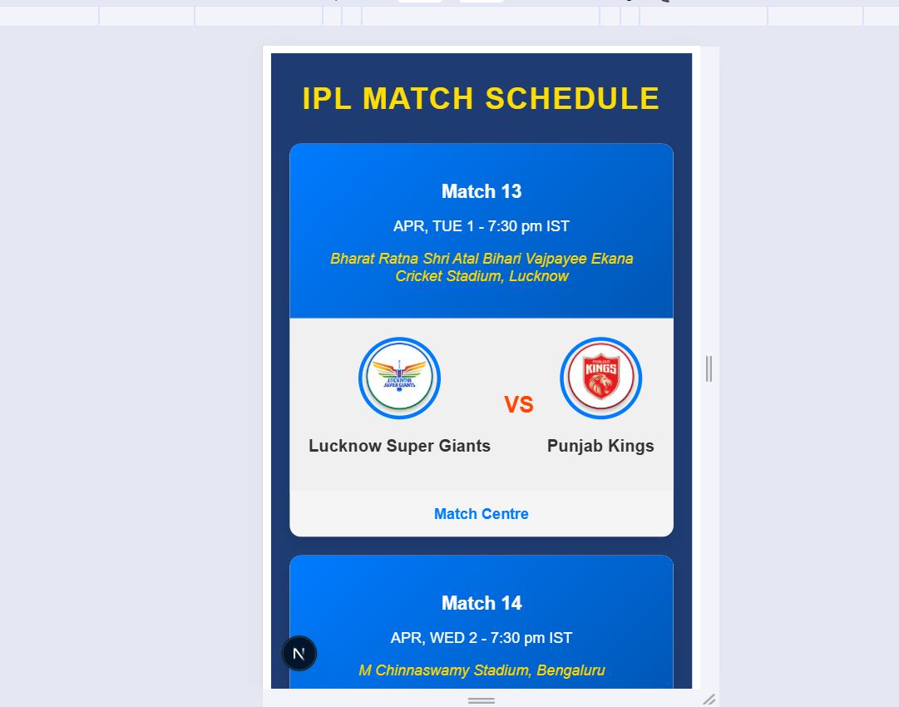
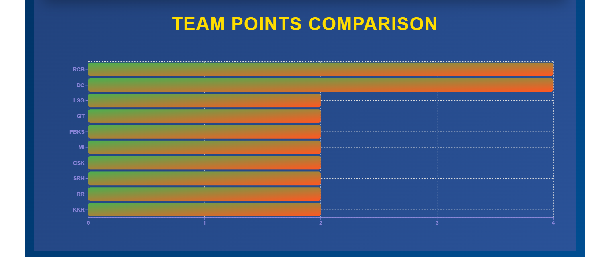
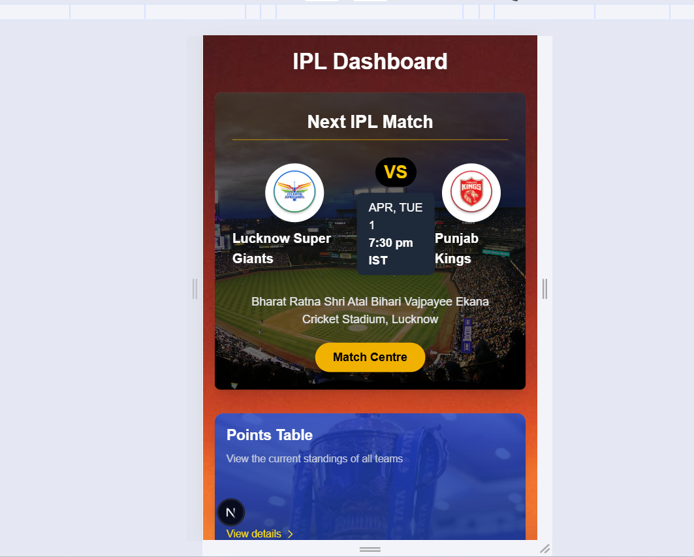
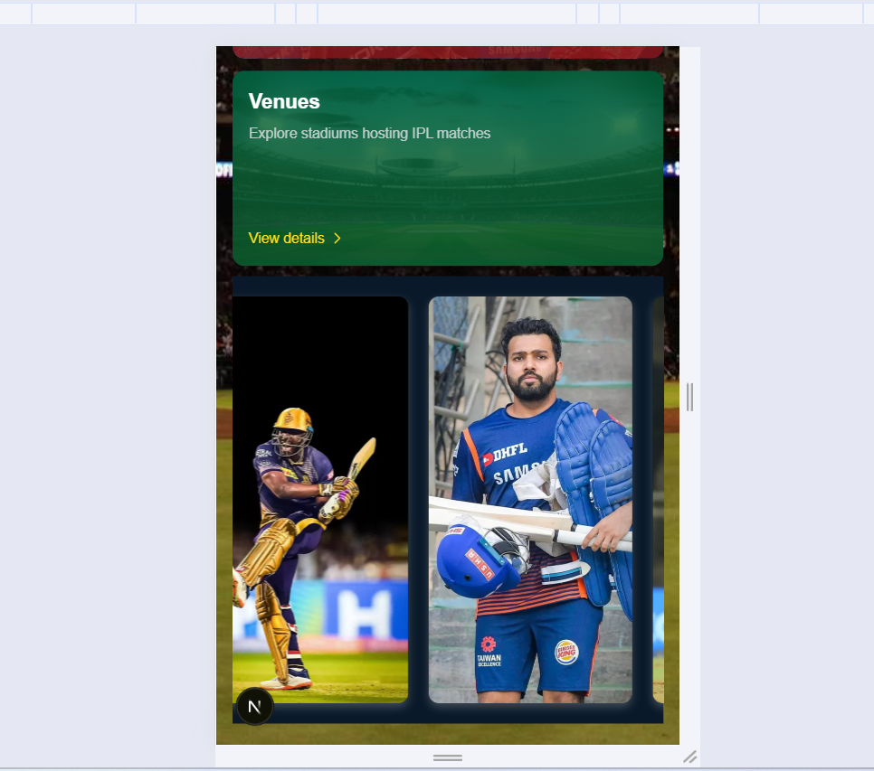
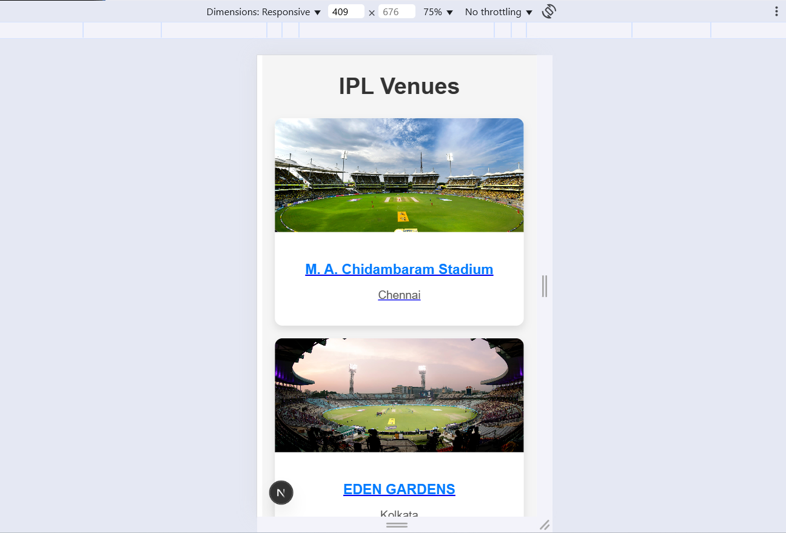
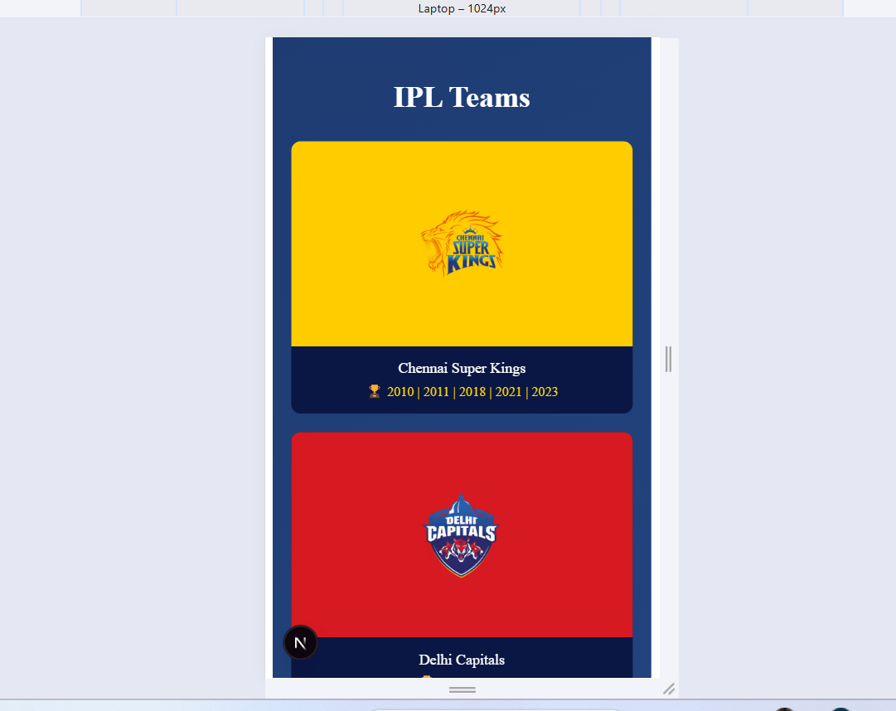


## Features

- **Live IPL Data Scraping**: Uses Puppeteer to fetch real-time data from IPL's official website.
- **Caching Mechanism**: Reduces server load by storing data for a set time before refreshing.
- **Interactive UI**: Built with Next.js, Tailwind CSS, and Recharts for smooth UI and data representation.
- **Graphical Representations**: Uses Recharts to visualize team standings and performance.
- **Responsive Design**: Optimized for both desktop and mobile devices.

## Tech Stack

- **Frontend**: Next.js, React, Tailwind CSS
- **Backend API**: Next.js API routes
- **Web Scraping**: Puppeteer
- **Data Visualization**: Recharts
- **State Management**: React Hooks

## Installation

### Prerequisites

- Node.js (>=16.x)
- npm or yarn

### Steps to Run Locally

1. Clone the repository:

   ```bash
   git clone https://github.com/yourusername/ipl-dashboard.git
   cd ipl-dashboard

2. Install dependencies:

   ```bash
   npm install or yarn install

3. Run the development server:

   ```bash
   npm run dev or yarn dev

4. Open in browser: Go to http://localhost:3000

### API Endpoints
- GET /api/points-table - Fetches the latest IPL points table.
- GET /api/schedule - Fetches the IPL schedule.
- GET /api/teams - Fetches all the IPL teams.
- GET /api/venues - Fetches all the IPL venues.


### File Structure

ipl-dashboard/
│── components/        # Reusable UI components
│── pages/             # Next.js pages
│   ├── index.js       # Homepage with sections
│   ├── points-table.js # Points table page
│   ├── teams.js       # Teams information page
│   ├── venues.js      # Venues details page
│── styles/            # CSS and Tailwind styles
│── public/            # Static assets
│── api/               # Backend API routes
│   ├── points-table.js # Scraper to fetch IPL points table
│── package.json       # Dependencies & scripts
│── README.md          # Documentation

### Author
- Shubham Shrivastava